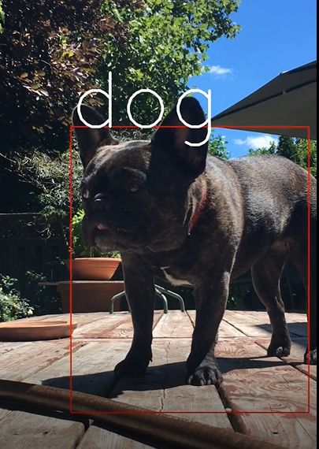

By using **Deep Learning** and more specifically, **SSD** (Single Shot Multibox Detection), you can easily program your computer to identify objects like dogs, cats, people, etc. This project is in Part 2 of the *Computer Vision A-Z* Course.



## Program Mechanics
In actuality, my program adds visual-graphics to videos, like in the above image of Lucy. 
It's a **4 step-process:**

1. **read input video:** taking each individual frame
2. **```for frame in video:```** find target => draw a box => label => done
  
3. String the edited frames together & "Voila!", you have your output video with cool rectangles & labels

## Next Steps
As a videography hobbyist, using these graphics would create a cool "tech" vibe.
To integrate it into my workflow, 2 things need to happen:

- [ ] preserve input-video's audio in the output-video
- [ ] let users choose where in their video to apply graphics, not just the whole thing
